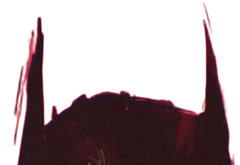

# 👋 Olá, eu sou o Kadu!

  

### 🦇 Sobre mim
Sou um estudante de programação, faço faculdade de Sistemas de Informação na Universidade Federal de Mato Grosso do Sul (UFMS), atualmente estou no 5° Semestre, período noturno, comecei em 2024, logo depois de me formar no ensino médio. Minha principal meta no momento é trabalhar na área para incrementar meu nível profissional. Tenho experiência com estruturação de bancos de dados em SQL e lógica de programação com Python e C. Além de ter facilidade, gosto de aprender coisas novas e estou sempre em busca disso para incrementar meu nível profissional.

- 💼 Não trabalho na área ainda, mas tenho total disponibilidade.
- 🎮 Curiosidade: gosto muito de jogar e de cinema.

---

### 🛠 Tecnologias que tenho experiência

  
  
  
  
  

---

### 📫 Contato

&nbsp;&nbsp;
  

